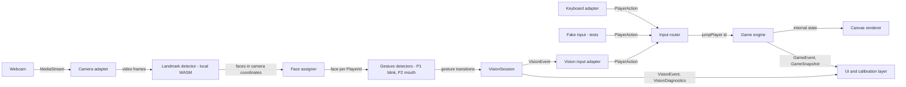

# Architecture

Status: Phase 1 design. Only `src/shared/**` (contracts) and a placeholder `src/main.ts` exist.
Everything described under `src/game`, `src/vision`, `src/app` and `src/ui` is **planned**.
Parameter values are starting points, to be tuned in Phase 4.

## 1. Goals and constraints

- Two players, one webcam, one screen. Player 1 jumps by blinking; Player 2 jumps by opening
  their mouth.
- All camera processing is local to the browser. No frames, landmarks or calibration data leave
  the device or are persisted.
- Static hosting: `npm run build` produces plain files in `dist/`. No backend.
- Keyboard controls always work, and the game is fully playable without a camera.
- Game logic is deterministic and unit-testable. No automated test needs a camera, a model or
  the network.
- Three agents can work in parallel with minimal merge conflicts.

## 2. Technology decisions

| Area            | Choice                                                                 | Reason                                                                                                                                                                      |
| --------------- | ---------------------------------------------------------------------- | --------------------------------------------------------------------------------------------------------------------------------------------------------------------------- |
| Language        | TypeScript 6.0, strict, `noUncheckedIndexedAccess`                     | Explicit contracts between agents, and safe indexing into landmark arrays. TypeScript 7 exists, but typescript-eslint 8.70 supports only `<6.1`, so 6.0 is pinned (`~6.0`). |
| Build and dev   | Vite 8                                                                 | Static output, a fast dev server, native TypeScript, dev-only pages for each module, and code splitting so the vision model loads only in camera mode.                      |
| Rendering       | Canvas 2D                                                              | Simple and fast enough for two lanes of sprites; no dependency.                                                                                                             |
| UI              | Plain TypeScript + DOM + CSS, no framework                             | A handful of screens; a framework would add weight and decisions without clear benefit.                                                                                     |
| Tests           | Vitest 5, Node environment by default, jsdom opt-in                    | Game and vision logic run headless. DOM tests opt in with `// @vitest-environment jsdom`.                                                                                   |
| Lint and format | ESLint 10 + type-aware typescript-eslint, Prettier 3                   | Floating-promise checks matter for camera lifecycle code. Lint also enforces module boundaries and privacy rules (§5). One formatter avoids diff noise between agents.      |
| Package manager | npm (with Node 24)                                                     | Ships with Node; the repository had no lockfile to preserve.                                                                                                                |
| Computer vision | **Proposed, not installed:** `@mediapipe/tasks-vision` Face Landmarker | See §15.                                                                                                                                                                    |

**Existing code.** `main` contained only a README. The unmerged remote branch
`origin/copilot/browser-based-endless-runner` holds a vanilla-JS prototype of a different
design: three players, jump and duck via eyebrow, hand and chin gestures, the legacy MediaPipe
`face_mesh`/`hands` solutions loaded from a CDN, frame-count physics, `Math.random`, game logic
mixed with rendering, no keyboard input and no tests. It is **not** adopted or merged. It is
left untouched as a reference for ideas: zone-based face assignment, stopping tracks on
shutdown, and the overlay drawing approach.

## 3. Data flow

1. **The webcam produces video frames.** The camera adapter opens a `MediaStream`
   (`audio: false`) after an explicit user click and attaches it to a `<video>` element owned by
   the UI.
2. **The vision adapter processes frames locally.** A frame loop (`requestVideoFrameCallback`,
   falling back to `requestAnimationFrame`) passes each new frame to the landmark detector
   (MediaPipe WASM, in the page). At most one inference is in flight; frames are skipped when
   busy.
3. **Face assignment maps detected faces to player identities.** Faces arrive in raw camera
   coordinates in arbitrary order. The face assigner converts them to display coordinates
   (§8) and keeps a stable `PlayerId → face` mapping (§9).
4. **Gesture detectors turn landmark measurements into stable gesture states.** For each
   assigned face, a metric (eye or mouth aspect ratio) is normalised with that player's
   calibration, smoothed, and fed to a hysteresis state machine (§10).
5. **Gesture transitions produce semantic events.** An `idle → active` transition emits exactly
   one `{ type: "gesture", playerId, gesture }` `VisionEvent`. Holding the gesture emits nothing.
6. **The application controller maps events to game commands.** `src/app` turns the configured
   gesture of each player into a `PlayerAction` (`{ type: "jump", source: "vision" }`). The
   input router calls `game.jumpPlayer(playerId)` for actions from every source: keyboard,
   vision, or test fakes.
7. **The game engine updates player state** in fixed simulation steps (§11).
8. **The renderer draws the new state** on the canvas. The UI shows scores, status and camera
   feedback from `GameSnapshot`, `GameEvent`s, `VisionEvent`s and `VisionDiagnostics`.



## 4. Components and boundaries

| Component                | Location (planned)                               | Owner           | Responsibility                                                                                                    | Must not                                                        |
| ------------------------ | ------------------------------------------------ | --------------- | ----------------------------------------------------------------------------------------------------------------- | --------------------------------------------------------------- |
| Shared contracts         | `src/shared/`                                    | Orch.           | Types for actions, game control, vision events and diagnostics; tiny pure helpers.                                | Import anything else in `src/`; hold runtime dependencies.      |
| Game engine              | `src/game/engine/`                               | Agent 1         | Deterministic simulation: physics, obstacles, collisions, scoring, status machine; implements `GameController`.   | Touch the DOM, canvas, camera, `Math.random` or `Date.now`.     |
| Frame loop               | `src/game/loop/`                                 | Agent 1         | Fixed-step accumulator driven by an injected `FrameScheduler` (default `requestAnimationFrame`).                  | Contain game rules.                                             |
| Renderer                 | `src/game/render/`                               | Agent 1         | Draws engine state on a canvas (lanes, dinos, obstacles, crash state); handles device pixel ratio.                | Mutate state or decide rules.                                   |
| Input abstraction        | `src/shared/input.ts`, `src/app/input-router.ts` | Orch. / Agent 3 | `PlayerAction` + `PlayerInputSource` contract; the router forwards actions to `GameController.jumpPlayer`.        | Know about concrete sources.                                    |
| Keyboard adapter         | `src/game/input/`                                | Agent 1         | `PlayerInputSource` from key presses (Player 1 `KeyW`, Player 2 `ArrowUp`); ignores auto-repeat.                  | Call the engine directly.                                       |
| Camera adapter           | `src/vision/camera/`                             | Agent 2         | `getUserMedia` wrapper over an injected `MediaDevices`; maps errors to `VisionErrorCode`; stops tracks.           | Be called without an explicit user action.                      |
| Landmark detector        | `src/vision/landmarks/`                          | Agent 2         | `LandmarkDetector` interface; the MediaPipe implementation is loaded lazily with a dynamic `import()`.            | Leak MediaPipe types outside `src/vision`.                      |
| Face assigner            | `src/vision/assignment/`                         | Agent 2         | Replaceable `FaceAssigner` strategy: left/right lock plus tracking, lost and reacquired faces, swap, reset.       | Depend on the detector's face order.                            |
| Gesture detector         | `src/vision/gestures/`                           | Agent 2         | Pure metrics, normalisation, smoothing and a hysteresis state machine; emits transitions.                         | Emit per frame; know about jumping.                             |
| Calibration              | `src/vision/calibration/`                        | Agent 2         | Per-player baseline and gesture sampling, threshold derivation, failure reasons; in memory only.                  | Persist data.                                                   |
| Vision session           | `src/vision/session.ts`, `src/vision/index.ts`   | Agent 2         | Composes the above into `VisionSession`; lifecycle, events, diagnostics.                                          | Import game, app or ui.                                         |
| Application controller   | `src/app/`                                       | Agent 3         | Composition root; app state machine (screens); maps vision events to actions; camera lifecycle; fallbacks.        | Import module internals; implement game rules or gesture logic. |
| UI and calibration layer | `src/ui/`, `index.html`                          | Agent 3         | Screens, permission and privacy notice, positioning and calibration guidance, HUD, errors, debug overlay, layout. | Import game or vision; access the camera.                       |

## 5. Dependency rules

```text
src/main.ts ──► src/app ──► src/game/index.ts ──► src/shared
                   │  └───► src/vision/index.ts ─► src/shared
                   └──────► src/ui ──────────────► src/shared
```

`eslint.config.js` enforces the following. Never weaken these rules without an orchestrator
decision.

| Files                       | Rule                                                                                                                                                               |
| --------------------------- | ------------------------------------------------------------------------------------------------------------------------------------------------------------------ |
| `src/shared/**`             | No imports from other `src` folders and no package imports.                                                                                                        |
| `src/game/**`               | No imports of `vision`, `app`, `ui` or `@mediapipe/*`. No camera APIs. No `Math.random` or `Date.now`.                                                             |
| `src/vision/**`             | No imports of `game`, `app` or `ui`. No `localStorage`/`sessionStorage`/`indexedDB`, `fetch`/`XMLHttpRequest`/`WebSocket`/`EventSource` or `navigator.sendBeacon`. |
| `src/app/**`, `src/main.ts` | Import `game` and `vision` only through `index.ts`. No `@mediapipe/*`. No camera APIs.                                                                             |
| `src/ui/**`                 | No imports of `game`, `vision` or `app`. No `@mediapipe/*`. No camera APIs.                                                                                        |

Imports are relative; there are no path aliases. The rules match whole path segments, so
`../vision/x` is caught but `./vision-helper` is not.

## 6. Shared contracts

The TypeScript files in `src/shared/` are the source of truth. `tests/shared/contracts.test.ts`
pins their shape, so an unplanned change fails `npm run typecheck`.

| File        | Contents                                                                                                                                                                                               |
| ----------- | ------------------------------------------------------------------------------------------------------------------------------------------------------------------------------------------------------ |
| `common.ts` | `TimestampMs` (`performance.now()` clock), `Unsubscribe`, `Listener<T>`, `assertNever`.                                                                                                                |
| `player.ts` | `PlayerId = 1 \| 2`, `PLAYER_IDS`, `PerPlayer<T>`, `isPlayerId`, `otherPlayer`.                                                                                                                        |
| `input.ts`  | `PlayerAction` (currently only `JumpAction`), `PlayerActionSource = "keyboard" \| "vision" \| "simulated"`, `PlayerInputSource`.                                                                       |
| `game.ts`   | `GameController`, `GameStatus`, `GameSnapshot`, `PlayerSnapshot`, `GameResult`, `GameEvent`.                                                                                                           |
| `vision.ts` | `GestureKind`, `DEFAULT_PLAYER_GESTURES`, `VisionSession`, `VisionSessionOptions`, `VisionSessionFactory`, `VisionEvent`, `VisionStatus`, `VisionError(Code)`, calibration types, `VisionDiagnostics`. |

Core signatures:

```ts
type PlayerId = 1 | 2;

type PlayerAction = {
  type: "jump";
  playerId: PlayerId;
  source: "keyboard" | "vision" | "simulated";
  timestamp: TimestampMs;
};

interface PlayerInputSource {
  start(): Promise<void> | void;
  stop(): Promise<void> | void;
  subscribe(listener: (action: PlayerAction) => void): Unsubscribe;
}

interface GameController {
  jumpPlayer(playerId: PlayerId): void;
  start(): void;
  pause(): void;
  resume(): void;
  restart(): void;
  getSnapshot(): GameSnapshot;
  subscribe(listener: (event: GameEvent) => void): Unsubscribe;
}

interface VisionSession {
  start(): Promise<VisionStartResult>; // never rejects
  stop(): Promise<void>;
  dispose(): Promise<void>;
  getStatus(): VisionStatus;
  subscribe(listener: (event: VisionEvent) => void): Unsubscribe;
  startCalibration(players?: readonly PlayerId[]): void;
  cancelCalibration(): void;
  useDefaultCalibration(players?: readonly PlayerId[]): void;
  swapPlayers(): void;
  resetAssignment(): void;
  getDiagnostics(): VisionDiagnostics;
}
```

Semantics every implementation and fake must follow:

- **Commands never throw for state reasons.** `jumpPlayer` during `paused` is simply ignored.
- **Listeners are synchronous**, called in subscription order after the state change they
  describe. `Unsubscribe` is idempotent.
- **Timestamps** use the `performance.now()` clock. A vision `JumpAction.timestamp` is the video
  frame time of the gesture, which allows end-to-end latency to be measured.
- **Gesture events are edge-triggered.** Example names from the brief map as follows:
  `player1-blink` ≙ `{ type: "gesture", playerId: 1, gesture: "blink" }`;
  `player2-mouth-open` ≙ `{ type: "gesture", playerId: 2, gesture: "mouth-open" }`;
  `face-lost` and `calibration-complete` are event types. Keeping `playerId` and `gesture` as
  separate fields lets the gesture-to-player mapping stay configuration
  (`VisionSessionOptions.playerGestures`).
- **Diagnostics are polled** with `getDiagnostics()`, not pushed per frame, so the event stream
  stays semantic.

Planned wiring in `src/app` (Agent 3):

```ts
const game = createGame({ canvas }); // src/game
const keyboard = createKeyboardInputSource({ target: window }); // src/game
const vision = createVisionSession({ video, mirrored: true }); // src/vision
const visionInput = createVisionInputSource(vision, DEFAULT_PLAYER_GESTURES); // src/app
const disconnect = connectInputs([keyboard, visionInput], game); // src/app
// vision.start() is called only from the "Play with camera" click handler.
```

`createVisionInputSource().start()` only starts forwarding events. It never opens the camera.

## 7. Directory structure

`✓` = exists now; everything else is planned.

```text
.
├── AGENTS.md ✓                      rules for all agents
├── README.md ✓
├── docs/ ✓                          architecture, workflow, decisions, tasks/
├── index.html ✓                     app entry (placeholder; Agent 3)
├── public/                          static assets copied as-is (Agent 3)
│   └── vision/                      self-hosted model + WASM (Agent 2; see O-01)
├── src/
│   ├── main.ts ✓                    bootstrap (placeholder; Agent 3)
│   ├── shared/ ✓                    contracts (orchestrator)
│   ├── game/                        Agent 1
│   │   ├── index.ts                 public API: createGame, createGameEngine,
│   │   │                            createKeyboardInputSource, DEFAULT_* constants
│   │   ├── config.ts  engine/  loop/  render/  input/  random.ts
│   │   └── playground/              dev-only page: /src/game/playground/
│   ├── vision/                      Agent 2
│   │   ├── index.ts                 public API: createVisionSession, isCameraSupported
│   │   ├── session.ts  config.ts  camera/  landmarks/  geometry/
│   │   ├── assignment/  gestures/  calibration/  diagnostics/
│   │   └── lab/                     dev-only Vision Lab page: /src/vision/lab/
│   ├── app/                         Agent 3: composition root, app state machine,
│   │                                input router, vision input adapter
│   └── ui/                          Agent 3: screens, HUD, overlays, styles
├── tests/
│   ├── shared/ ✓                    contract tests (orchestrator)
│   ├── game/                        Agent 1
│   ├── vision/                      Agent 2 (synthetic landmark fixtures only)
│   ├── app/  ui/  integration/      Agent 3
│   └── support/                     Agent 3: shared fakes (FakeVisionSession, ...)
└── (config) ✓ package.json, tsconfig.json, vite.config.ts, vitest.config.ts,
               eslint.config.js, .prettierrc.json, .gitattributes, .gitignore
```

Dev-only pages under `src/*/playground` and `src/*/lab` are served by `npm run dev`. They are
never part of the production build (decision O-09).

## 8. Coordinate spaces and mirroring

The raw camera frame and the preview players see are not the same. Never assume they are.

- **Camera space:** MediaPipe landmarks are normalised to the _raw_ frame, `x, y ∈ [0, 1]`,
  origin top-left. For a front-facing webcam the raw frame is _not_ mirrored: a player standing
  on the players' left appears on the _right_ of the raw frame (larger `x`).
- **Display space:** the preview as rendered on screen. With `mirrored: true` (the default: the
  UI applies `transform: scaleX(-1)` to the `<video>`), `displayX = 1 − cameraX`, so the player
  on the left physically appears on the left of the preview. With `mirrored: false`,
  `displayX = cameraX`.
- **Pixel space for measurements:** normalised `x` and `y` are scaled by different frame
  dimensions. Convert to pixels (`x·width`, `y·height`) before computing distances or aspect
  ratios. On a 16:9 frame, skipping this distorts every ratio.

Rules:

- One function (`toDisplayX` or `toDisplayPoint` in `src/vision/geometry/`) performs the
  conversion, and it is unit-tested for both values of `mirrored`.
- Face assignment, `VisionDiagnostics.faceRect` and `unassignedFaces` use **display space**. The
  UI draws its overlay on an **unmirrored** canvas stacked over the mirrored video, so labels
  stay readable.
- The UI should give the video `object-fit: contain`, or apply the same crop mapping to the
  overlay; `cover` cropping would shift the rectangles.

## 9. Player assignment

Implemented behind a replaceable `FaceAssigner` interface, so left/right plus tracking can
later be swapped for something more robust.

1. **Lock at calibration.** When exactly two faces have been visible and stable for
   `assignmentStableMs` (initially 750 ms), sort them by display-space centre `x`: the **left**
   face becomes Player 1 and the **right** face Player 2. Emit
   `players-assigned` (`reason: "calibration"`). With more than two faces (only possible if
   `numFaces > 2`), take the two largest faces.
2. **Track, don't re-sort.** On each frame, match detections to the two tracks by minimum total
   distance between display-space face centres, normalised by face width. The detector's output
   order is ignored. Small movements never swap identities because matching uses the
   previous positions, not the current left/right order. When both assignments cost about the
   same (within a margin, e.g. while faces overlap), keep the previous mapping. Switch only
   after the alternative has been clearly better for several consecutive frames.
3. **Crossing positions.** Identity follows the tracked person, and their calibration goes with
   them. After crossing, Player 1 may be on the right; the always-visible face labels show this.
   If crossing causes an occlusion, the lost/reacquire rules below apply. The UI offers
   **Swap players** (`swapPlayers()`) and **Reset assignment** (`resetAssignment()`, which
   re-locks by left/right). This follow-the-person policy is decision O-06.
4. **Temporarily leaving the frame.** A track missing for `faceLostAfterMs` (initially 400 ms)
   emits one `face-lost`. That player's gesture detector becomes `disarmed`, so no events fire.
   The track keeps its last position for `reacquireWindowMs` (initially 3000 ms).
   - A new face that appears while the other player is tracked is given to the lost track, and
     `face-found` is emitted. The detector stays disarmed until it sees the reset condition
     (eyes open, mouth closed), so reacquiring a face never fires a gesture.
   - If both players were lost and faces reappear inside the window, match them to the last
     known positions. After the window, or if that match is ambiguous, re-lock by left/right and
     emit `players-assigned` (`reason: "reacquired"`) so the UI can prompt a check.
5. **One face only.** Before the lock, `faces-changed` reports `count: 1` and the UI explains
   that both players must be visible. The UI can offer to continue with the other player on
   the keyboard; the single face is then assigned by side (`displayX < 0.5` → Player 1).
6. **A third person** (bystander): with `numFaces: 2` the model may return the bystander
   instead of a player. This is a known limitation (R-09); raising `numFaces` to 3 costs
   performance (O-11).
7. **Debounce `faces-changed`** so a single-frame dropout does not generate events.

## 10. Gesture detection

### 10.1 Metrics

Both metrics are computed in pixel space (§8) from MediaPipe's 468-point mesh. The indices
below are the ones commonly used with this mesh. **Agent 2 must verify them in the Vision Lab**
before relying on them.

- **Eye aspect ratio (EAR)** per eye, from six points `p1…p6` (corners `p1`, `p4`; upper lid
  `p2`, `p3`; lower lid `p6`, `p5`):
  `EAR = (|p2 − p6| + |p3 − p5|) / (2 · |p1 − p4|)`.
  Candidate indices: one eye `[33, 160, 158, 133, 153, 144]`, the other
  `[362, 385, 387, 263, 373, 380]`.
  Combine the eyes with **max** (the more open eye), so a wink or a one-eye squint does not
  count as a blink.
- **Mouth aspect ratio (MAR):** inner-lip vertical gap over mouth width, e.g.
  `MAR = |13 − 14| / |78 − 308|`. Averaging several vertical pairs (`82–87`, `13–14`,
  `312–317`) reduces noise.
- **Alternative signal:** Face Landmarker can also output blendshape scores (`eyeBlinkLeft`,
  `eyeBlinkRight`, `jawOpen`). They are already normalised but cost extra inference time. Keep
  them behind the same metric interface as an option to evaluate in the Lab, not as the
  default.

### 10.2 Normalisation and per-player calibration

Faces, eyelid shapes, glasses and camera distances vary, so thresholds on raw EAR and MAR are
not portable. Every metric is mapped to an **activation score** where 0 means neutral and 1
means the full deliberate gesture:

- Blink: `score = clamp((EAR_neutral − EAR) / (EAR_neutral − EAR_blink), 0, 1)`
- Mouth: `score = clamp((MAR − MAR_neutral) / (MAR_open − MAR_neutral), 0, 1)`

Calibration measures these levels per player, concurrently for both players:

1. **Assign players** (§9).
2. **Neutral** (about 2 s): the players look at the screen with eyes open and mouth closed.
   Store the median and spread of the metric.
3. **Gesture**: Player 1 blinks deliberately three times; Player 2 opens their mouth wide
   three times (timeout about 10 s). Store the level reached on the peaks, e.g. the median of
   the peak values.
4. **Validate.** If the separation between neutral and gesture levels is too small compared
   with the neutral noise, fail with `gesture-not-detected` or `unstable-measurements`. The UI
   offers a retry, defaults, or keyboard.

`useDefaultCalibration()` applies population defaults (starting guesses: EAR open ≈ 0.28, closed
≈ 0.12; MAR closed ≈ 0.05, open ≈ 0.45). Emit `calibration-complete` with `mode: "default"`.
Calibration lives **in memory only** and follows the player on `swapPlayers()`.

### 10.3 Hysteresis

**Hysteresis** means switching on and switching off at _different_ thresholds, so that a
signal hovering near one threshold cannot flip the state back and forth. A gesture activates
only when the score rises **above the enter threshold** (e.g. 0.60). It resets only when the
score falls **below the lower exit threshold** (e.g. 0.35). Between the two, the previous state
is kept. The gap between the thresholds is the hysteresis band. It absorbs landmark jitter
that would otherwise produce bursts of events.

### 10.4 Gesture state machine (per player)

```text
            score ≤ exit                  score ≥ enter
disarmed ───────────────► idle ────────────────────────► pending
    ▲                      ▲  ▲   score < enter before      │ held ≥ minActiveMs
    │ face lost /          │  └── minActiveMs (no event) ───┤ and cooldown over
    │ reacquired /         │                                ▼
    │ calibration          └────────── score ≤ exit ◄──── active   ── emits ONE "gesture" event on entry
```

- An event is emitted **only on entering `active`**. Remaining `active` emits nothing.
  Returning to `idle` needs `score ≤ exit`: eyes reopened, or mouth closed.
- `disarmed` guarantees that a new open-to-closed transition is seen before anything fires. It
  is entered after start, calibration, and losing or reacquiring a face.
- An unknown score (`null`: face not visible or quality gate failed) never advances the state.
  In `pending`, it cancels back to `idle`.
- The machine is **time-based**, using frame timestamps, not frame counts, so it behaves the
  same at 15, 30 or 60 fps.

### 10.5 Temporal smoothing

Use a time-constant exponential moving average,
`α = 1 − exp(−Δt / τ)` with `τ ≈ 40 ms`. Smoothing reduces jitter but adds latency and can
flatten a short blink. Keep τ small, and tune it together with the thresholds in the Lab.
A median of three frames is an acceptable alternative.

### 10.6 Minimum duration, cooldown and repeat protection

- `minActiveMs` (blink ≈ 80 ms, mouth ≈ 80 ms): the score must stay above `enter` this long.
  It filters one-frame spikes, and for blinks it partly filters involuntary blinks.
- `cooldownMs` (≈ 350 ms): after an event, a new event is suppressed even if the state machine
  cycles.
- The reset requirement (§10.4) plus cooldown means a held gesture can never trigger continuous
  jumping. The game also ignores jumps while airborne.

### 10.7 False positives

| Source                                | Mitigation                                                                                                             |
| ------------------------------------- | ---------------------------------------------------------------------------------------------------------------------- |
| Looking down (EAR drops)              | Quality gate on head pitch and yaw from `facialTransformationMatrixes`: score `null` beyond e.g. 25° pitch or 30° yaw. |
| Talking or laughing (mouth)           | Mouth enter threshold calibrated on a _wide_ deliberate opening, `minActiveMs`, cooldown.                              |
| Winks, squints                        | Blink uses the more-open eye (max EAR).                                                                                |
| Landmark jitter on small or far faces | Hysteresis, smoothing, minimum face size (score `null` when the face is too small), instructions to move closer.       |
| Reacquired face mid-gesture           | `disarmed` state.                                                                                                      |
| Lighting, glasses, reflections        | Per-player calibration; failure reasons explain the problem; keyboard fallback.                                        |

### 10.8 Involuntary and intentional blinks

Natural blinks happen every few seconds and last roughly 100–400 ms, usually with incomplete
closure. They cannot be fully separated from control blinks without adding latency. The
strategy:

1. Calibrate the blink level on **deliberate, firm** blinks, so the enter threshold sits
   deeper than a typical light natural blink.
2. Require `minActiveMs` of closure (start around 80 ms).
3. No separate long-blink mode is offered (decision O-07). `minActiveMs` stays an internal
   tunable; revisit only if Phase 4 false-jump counts are high.
4. Accept some residual false jumps and document them. Note that a blinking player cannot see
   the screen while their eyes are closed, which is another reason to keep `minActiveMs` short.

### 10.9 Debug output

`getDiagnostics()` exposes, per player: tracking state, face rectangle, raw metric, smoothed
score, enter and exit thresholds, detector state, cooldown remaining, last gesture time and
calibration mode. Globally: status, mirroring, faces detected, unassigned faces, processing fps
and inference time. The Vision Lab (Agent 2) and the in-app debug overlay (Agent 3) render
these. The overlay is off by default and toggled with `` ` `` or `?debug=1`.

### 10.10 Initial parameters (tune in Phase 4)

| Parameter                                             | Start value                                                        |
| ----------------------------------------------------- | ------------------------------------------------------------------ |
| Camera constraints                                    | `facingMode: "user"`, ideal 1280×720, ideal 30 fps, `audio: false` |
| `numFaces`                                            | 2                                                                  |
| MediaPipe detection, presence and tracking confidence | 0.5                                                                |
| Smoothing τ                                           | 40 ms                                                              |
| Blink enter / exit score                              | 0.60 / 0.35                                                        |
| Mouth enter / exit score                              | 0.55 / 0.30                                                        |
| `minActiveMs` (blink / mouth)                         | 80 / 80 ms                                                         |
| `cooldownMs`                                          | 350 ms                                                             |
| `faceLostAfterMs` / face found after                  | 400 / 200 ms                                                       |
| `reacquireWindowMs`                                   | 3000 ms                                                            |
| `assignmentStableMs`                                  | 750 ms                                                             |
| Calibration: neutral / gesture timeout / repetitions  | 2 s / 10 s / 3                                                     |

## 11. Game engine design (Agent 1)

- **One canvas, two stacked lanes:** Player 1 on top, Player 2 below, each labelled with its
  player number and gesture. Only jump actions are in scope; there is no ducking.
- **Synchronised obstacles:** one obstacle sequence from a seeded PRNG drives both lanes, so
  both players meet identical obstacles at identical times. Collision is resolved per lane. A
  crashed player's lane greys out while the other continues.
- **Only ground obstacles that one jump can clear.** Spacing grows with speed, so every
  sequence is clearable. It includes a reaction allowance (≈ 0.35 s) for vision latency.
- **Fixed time step** (1/120 s) with an accumulator. Real frame deltas are clamped (≤ 100 ms)
  so a background tab cannot cause a jump in time. Physics uses units per second. Identical
  input sequences give identical results at any render frame rate.
- **Determinism:** the engine takes a `seed`, and `restart()` derives the next seed from the
  engine's own PRNG. There is no `Math.random`.
- **Jump rules:** `jumpPlayer` is applied on the next step. Airborne requests are ignored
  except within `jumpBufferMs` (≈ 100 ms) before landing, which forgives vision latency.
- **Round end:** by default the round ends when **both** players have crashed; the higher
  score wins. On equal scores, the player who crashed later (or did not crash) wins; it is a
  tie (`winner: null`) only when both crash in the same step with equal scores (ICR 1). A
  `first-crash` mode is a configuration option (O-03).
- **State vs. rendering:** the engine exposes internal state to the renderer read-only, and a
  `GameSnapshot` to the UI. The renderer never mutates.
- **Public API** (`src/game/index.ts`): `createGame({ canvas, seed?, config?, scheduler? })`
  returns a `GameHandle` (`GameController` + `destroy()`). Also exported:
  `createGameEngine({ seed?, config? })` (headless, with `advance(dtMs)`),
  `createKeyboardInputSource({ target, bindings? })`, `DEFAULT_GAME_CONFIG` and
  `DEFAULT_KEY_BINDINGS`.

## 12. Application flow and fallbacks (Agent 3)

```text
welcome ──"Keyboard only"──────────────────────────────────────────► ready
   │ "Play with camera" (explicit click; privacy notice shown first)
   ▼
camera-starting (requesting-camera → loading-model) ──error──► camera-error ─► retry | keyboard only
   ▼
positioning (live preview, face labels, "P1 left / P2 right", needs 2 faces) ─► calibrating ─► ready
   calibration failure ─► retry | use defaults | keyboard only
ready ─Enter/Start─► playing ⇄ paused ─► game-over ─Enter/Restart─► playing
```

- Keyboard input is always active, including in camera mode.
- App-level keys: `Enter` start or restart, `P` or `Escape` pause and resume, `` ` `` debug
  overlay. Enter on a focused button must not double-trigger.
- During play, a lost face shows a non-blocking warning on that player's HUD. The game does
  **not** auto-pause by default (O-04).
- `visibilitychange` to hidden pauses the game. `pagehide`, keyboard-only, "camera off" and
  `destroy()` all call `vision.stop()`.
- User-facing copy per `VisionErrorCode`: permission denied (how to re-enable, or play with
  the keyboard), not found, in use, unsupported or insecure context, model load failed,
  disconnected.
- Always visible in camera mode: face labels "P1" and "P2" over the preview, and a short
  "gesture detected" pulse on that player's HUD (no strobing, and respects
  `prefers-reduced-motion`).

## 13. Testing strategy and fake sources

| Layer            | How it runs without a camera                                                                                                                                                                  | Owner   |
| ---------------- | --------------------------------------------------------------------------------------------------------------------------------------------------------------------------------------------- | ------- |
| Contracts        | Runtime helpers + `expectTypeOf` shape tests, `tests/shared/`.                                                                                                                                | Orch.   |
| Game engine      | Headless `createGameEngine({ seed })` + `advance(dtMs)` + `jumpPlayer`; a manual `FrameScheduler` for the loop; a fake 2D context for render smoke tests.                                     | Agent 1 |
| Keyboard adapter | A plain `EventTarget` + synthetic key events.                                                                                                                                                 | Agent 1 |
| Vision logic     | Pure functions fed with **synthetic landmark fixtures** and synthetic score time series (e.g. noisy signals around a threshold at 15, 30 and 60 fps).                                         | Agent 2 |
| Vision session   | Injected fake `MediaDevices` (grant, deny, not found, in use, track ended) and a fake `LandmarkDetector` replaying scripted faces. MediaPipe is never loaded in tests.                        | Agent 2 |
| App and UI       | `tests/support/`: `FakeVisionSession` (scripted `VisionEvent`s, start results, diagnostics), `FakeGameController` (records calls), `FakeInputSource` (`emit(action)`). DOM tests under jsdom. | Agent 3 |
| Manual and dev   | A dev-only simulated vision mode (`?vision=simulated`, `import.meta.env.DEV` only) drives the full vision path from keys, to exercise the UI flows without a camera.                          | Agent 3 |
| End to end       | Playwright with Chromium's fake media device for permission flows (the fake camera has no faces). Approved (O-05); run with `npm run test:e2e`, outside `npm run check`.                      | Agent 3 |

**Substituting a fake gesture source.** The app receives its factories by dependency
injection (`createApp(root, { createGame, createKeyboardInputSource, createVisionSession,
isCameraSupported })`). A test passes a `createVisionSession` that returns a `FakeVisionSession`,
calls `fake.emit({ type: "gesture", playerId: 1, gesture: "blink", timestamp })`, and asserts that
`FakeGameController.jumpPlayer(1)` was called exactly once. The same test can emit `face-lost`,
`calibration-failed` or a `{ ok: false }` start result to drive error screens. At the lowest
level, anything implementing `PlayerInputSource` can feed the input router.

## 14. Privacy and security design

- Frames go from the `<video>` element straight to in-page WASM inference. Nothing is uploaded,
  recorded or persisted. Lint blocks storage and network APIs in `src/vision`.
- Camera permission is requested only from an explicit click, after a notice that processing is
  local. `audio: false`.
- `stop()` cancels the frame loop, stops **every** `MediaStreamTrack` and clears
  `video.srcObject`. `dispose()` also closes the model. Listening for a track's `ended` event
  reports `camera-disconnected`.
- **Content Security Policy (production build):** Agent 3 adds a `<meta>` CSP through an inline
  Vite plugin (`apply: "build"`, so dev HMR is not broken). Draft:
  `default-src 'self'; script-src 'self' 'wasm-unsafe-eval'; connect-src 'self'; img-src 'self' data: blob:; media-src 'self' blob: mediastream:; worker-src 'self' blob:; style-src 'self'; object-src 'none'; base-uri 'self'`.
  `connect-src 'self'` backs the local-only promise technically, and it also blocks
  MediaPipe 1.0.1's built-in usage telemetry to `odml.pa.googleapis.com`, which cannot be
  disabled any other way (decision O-13). The exact directives MediaPipe
  needs must be verified in Phase 3.
- No analytics, telemetry, cookies or third-party runtime requests (O-01 covers asset hosting).

## 15. Proposed computer-vision dependency

**`@mediapipe/tasks-vision`** (Apache-2.0; version 1.0.1 was current on 2026-09-11; Agent 2
pins the exact version it installs), using **Face Landmarker**.

- Runs fully in the browser (WASM, GPU delegate with CPU fallback). Supports several faces
  (`numFaces`), 468 landmarks, and optional blendshapes and head-pose matrices.
- It is the maintained successor of the legacy `@mediapipe/face_mesh` solution used by the
  copilot prototype.
- Alternatives considered: TensorFlow.js `face-landmarks-detection` (heavier runtime, same
  underlying mesh) and `@vladmandic/human` (broader and heavier). Neither is needed.
- **Loading:** `import("@mediapipe/tasks-vision")` is dynamic, so keyboard-only players never
  download it. Planned usage, based on the 0.10.x documentation; **Agent 2 must verify it
  against the installed type definitions:**
  `FilesetResolver.forVisionTasks(wasmBase)` or an explicit `{ wasmLoaderPath, wasmBinaryPath }`
  fileset; `FaceLandmarker.createFromOptions(fileset, { baseOptions: { modelAssetPath,
delegate: "GPU" }, runningMode: "VIDEO", numFaces: 2 })`;
  `detectForVideo(video, timestampMs)` with strictly increasing timestamps; `close()`.
- **Assets:** the WASM files ship in the npm package. The `face_landmarker.task` model (a few
  MB) does not. Recommended: self-host both from the site origin under `public/vision/` (or
  WASM through Vite `?url` imports, if the package's `exports` allow it), with URLs built from
  `import.meta.env.BASE_URL`. This keeps the app working offline or behind a strict CSP and
  avoids third-party requests. Decision O-01: self-host both, and commit the model binary with its version,
  source, license and checksum recorded in `public/vision/README.md`.

## 16. Performance and browser support

- Targets, to be measured and not yet claimed: 60 fps rendering with vision running on a
  typical desktop or laptop; vision processing at 15 fps or more; gesture-to-jump latency of
  about 250 ms or less (frame timestamp to `player-jumped`).
- Inference runs on the main thread first, with at most one frame in flight. Move it to a Web
  Worker if profiling shows dropped game frames (O-08).
- **Browser support:** the target is the latest two major versions of desktop Chrome and Edge.
  **Nothing has been tested yet, so no browser is claimed as supported.** Firefox and Safari
  are best effort and unverified (GPU delegate, `requestVideoFrameCallback`). Mobile is out of
  scope. Phase 4 records every tested browser and version in `docs/decisions.md`.

## 17. Static deployment

- `npm run build` produces `dist/`: `index.html`, hashed JS and CSS, and `public/` assets.
  `base: "./"` keeps it working from any sub-path, such as a GitHub Pages project site.
- Camera access needs HTTPS. Static hosts such as GitHub Pages provide it; `npm run preview`
  on `localhost` is fine for local checks.
- No custom headers are required. COOP/COEP are not expected to be needed (to verify with the
  chosen MediaPipe build).
- **Hosting (decision O-02): GitHub Pages, deployed automatically on every push to `main`.**
  Agent 3 adds `.github/workflows/deploy-pages.yml` (triggers: `push` to `main` and
  `workflow_dispatch`). It runs `npm ci` and `npm run check`, then uploads `dist/` with the
  official Pages actions. A failing check never deploys. The user enables Settings → Pages →
  Source: GitHub Actions once. Because every merge publishes, only reviewed pull requests are
  merged (O-12).
